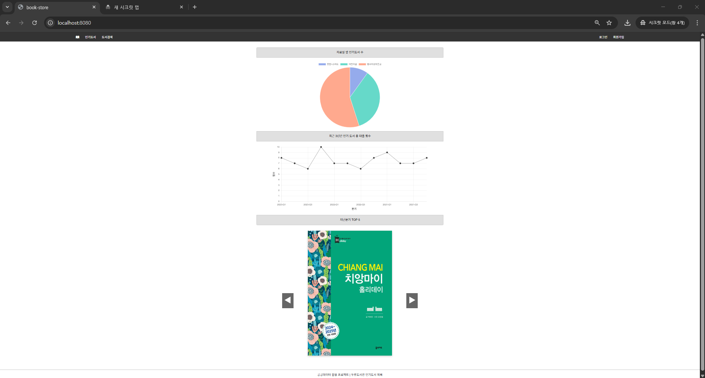
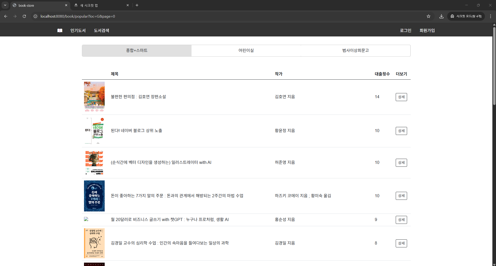
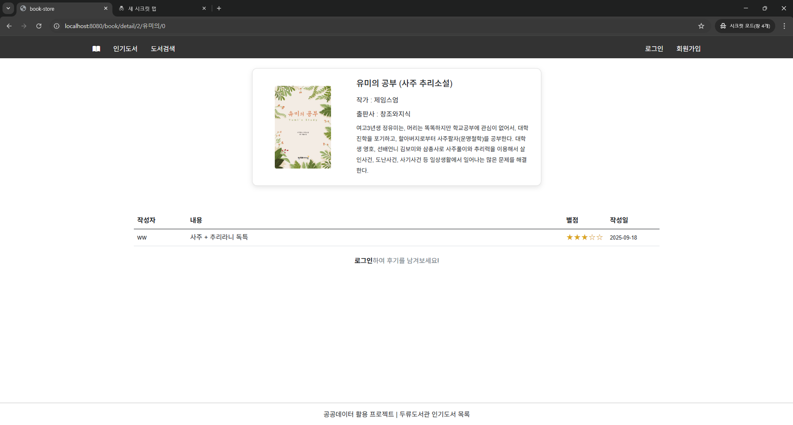
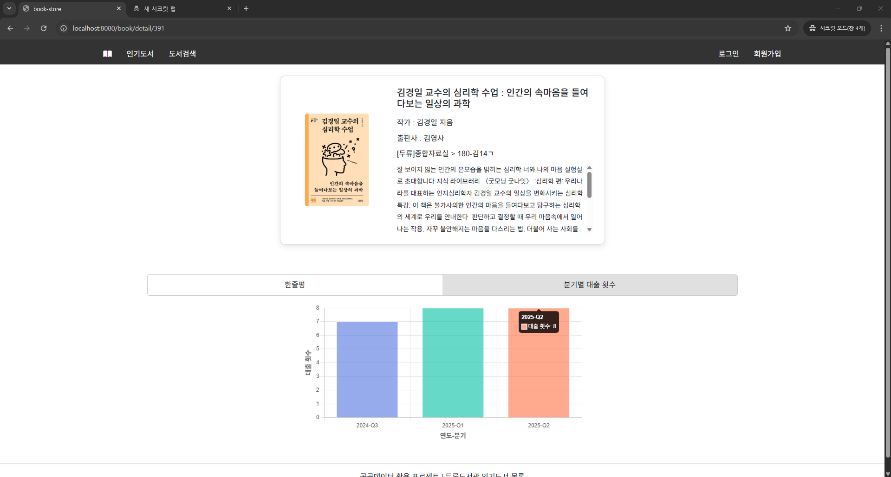
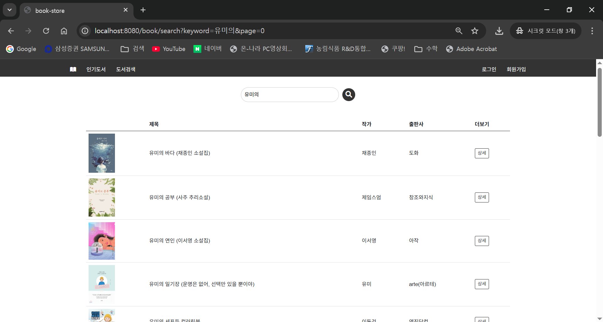
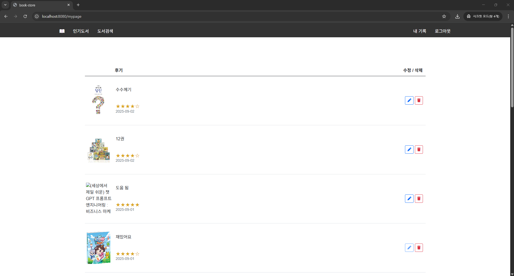

# 📚 BookStore

공공데이터 API(두류도서관 인기도서)와 네이버 도서검색 API를 활용하여  
인기도서 조회, 대출 추이 그래프, 도서 검색, 후기 작성 및 관리 기능을 제공하는 서비스입니다.

---

## 주요 기능

1. **메인 페이지**
    - 자료실 별 인기도서 수 (그래프)
    - 최근 3년간 분기별 인기도서 대출 횟수 (그래프)
    - 인기 도서 5권 (캐러셀)
2. **인기도서**
    - 자료실별 인기 도서 목록 확인 가능
3. **도서 상세 페이지**
    - 로그인 후 후기 작성 가능
    - 대출 횟수 추이를 그래프로 시각화
4. **도서 검색**
    - 네이버 도서 검색 API 기반 검색
    - 상세보기, 후기 작성 가능
    - DB에 없는 책은 자동 등록 후 후기 저장
5. **마이페이지**
    - 내가 작성한 후기 수정/삭제 가능

---

## 기술 스택

- **Backend**: Spring Boot, Spring Security, JWT
- **Database**: MySQL
- **Frontend**: JavaScript, HTML, CSS, Mustache
- **Libraries & Tools**: Lombok, Spring WebClient

---

## 아키텍처
```
[공공데이터 도서 API] ─▶ [Spring Boot 서버] ─▶ [MySQL DB]
                           │
               ┌───────────┴───────────┐
               ▼                       ▼
        [네이버 도서 API]       [프론트엔드 (Mustache, JS, HTML, CSS)]
               │                       │
               ▼                       │
        이미지, 상세 설명               ▼
               [사용자: 인기 도서 보기 / 검색 / 후기 작성 / 마이페이지]
```
---

## 화면 

- **메인 페이지**  
  

- **인기 도서**  
  

- **도서 상세 (후기 작성 + 대출 횟수 그래프)**  
  
  

- **도서 검색**  
  

- **마이페이지 (후기 관리)**  
  

---

## 향후 계획

- 현재는 터미널에서 데이터를 등록해야 하지만, <br> 
향후 **관리자 페이지를 구현**하여 웹에서 처리할 수 있도록 개선할 예정입니다.
